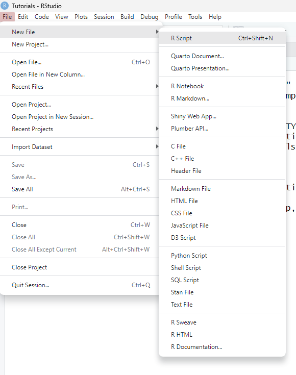
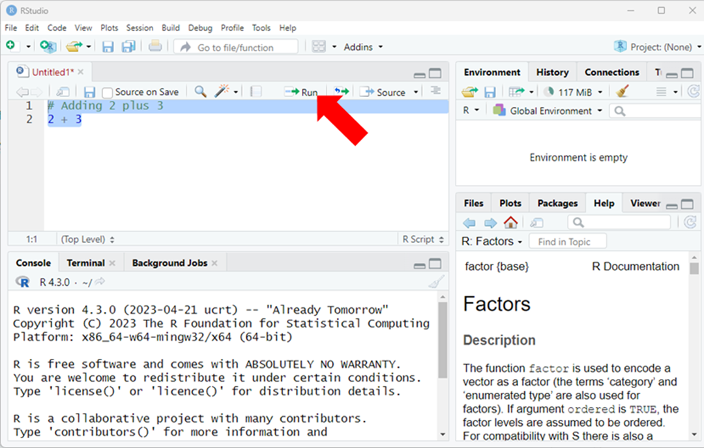
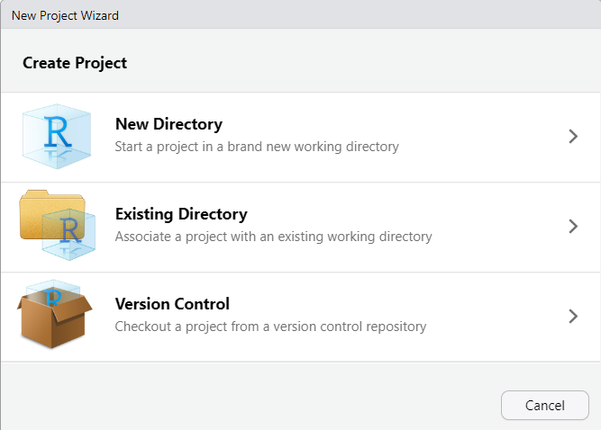
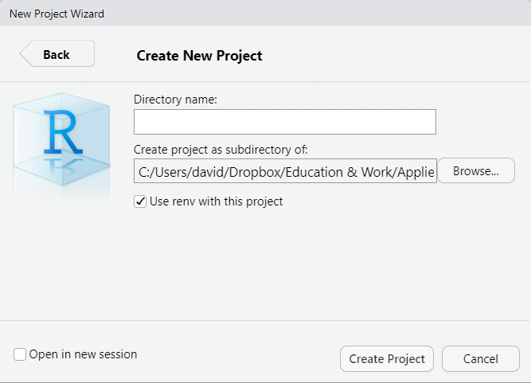

# Getting Started with R {#gettingstarted}

Like any program, there is bound to be a learning curve. Personally, one of the initial barriers I face when working with a new program is navigating the graphic user interface (GUI). Given that, in this chapter we will begin with a brief orientation to the RStudio program. Subsequent sections will focus on creating and saving R scripts, creating and working with RStudio projects, and how to follow along with written tutorials like the ones presented throughout this book.

## Orientation to RStudio

Rather than describe a series of screenshots, I believe one of the best ways to learn how to navigate the RStudio interface is to watch someone else. In the following video, I walk through key (but not all) features of the RStudio interface. This is one of the rare occasions in this book in which only a video tutorial is provided. Please note that in the video I walk through the Windows version of RStudio Desktop; the MacOS version may have slight differences in layout.

#### Video Tutorial

Link to Video Tutorial: XXXXX

## Creating & Saving an R Script {#createRscript}
  
An **R Script** is a text editor file in which you can create, edit, and save your R code for a particular task or project. An R Script file has the .R file extension. It is advisable that you type code directly into an R Script file if you wish to use the code again in the future or if you wish to save the code for another session. In general, try to avoid writing code directly into the Console using the command line if you wish to later reproduce your work. An R Script also allows you to make and save annotations (using the `#` symbol) to explain your code and decision making. Once you typed code (and annotations) into an R Script, you can highlight all of it (or chunks of it) and then click the Run button (or CTRL+Enter for Windows users or Command+Enter for Mac users), which is located in the upper right hand corner of the R Script editor window. 
  
In essence, an R Script allows you to save your code and to tell a story about what you have done. As much as you believe you'll never forget what you were doing in a particular R session, you will likely forget important details as time passes. Or, imagine a scenario in which someone else inherits your data project; a well-written and -documented R Script file will help them retrace your footsteps and onboard them onto the project.

#### Video Tutorial

Link to Video Tutorial: https://youtu.be/6_CFx5-KmMI

### Creating a New R Script 

To create a new R Script in RStudio, in the drop-down menu, select *File > New File > R Script* (as shown below).
  


### Using an R Script

To use an R Script, simply type into the script interface. To illustrate how to do this, let's type `# Adding 2 plus 3` on the first line; note that I began the line with the `#` symbol, which tells R that any text written to the right is annotation and thus won't be interpreted by R when you select it and click Run. On the next line, let's type `2 + 3`. Highlight both lines of script you typed and click the Run button (or CTRL+Enter for Windows users or Command+Enter for Mac users) (as shown below).
  
  
  
```{r}
# Adding 2 plus 3
2 + 3
```

Your Console window should show your output (as shown above).

### Saving an R Script

Always remember to save your R Script, and do so frequently. To save an R Script in RStudio, in the drop-down menu, select *File > Save As* (as shown below). After that, a window will open, and you can save the R Script file in a location of your choosing and with a name of your choosing.   
  
  

### Opening a Saved R Script

To open a saved R Script in RStudio, in the drop-down menu, select *File > Open File...* (as shown below). After that, a window will open, and you can select the R Script file to open.   
  
  

## Creating an RStudio Project

An **RStudio project** (or **R project**) file (.Rproj) is specific to RStudio and allows one to cluster associated scripts and data files into into a single workflow. For example, if you were evaluating a new onboarding program for your company, you could create an RStudio project with a common working directory that ties together any data files and R scripts that are relevant for evaluating the program. Creating an R project is not required for data management, analysis, and visualization work in RStudio, but it can be helpful. For more information on the value of RStudio projects, check out Wickham and Grolemund's [-@wickham2017] section on RStudio projects: https://r4ds.had.co.nz/workflow-projects.html#rstudio-projects.

#### Video Tutorial

Link to Video Tutorial: https://youtu.be/WyrJmJWgPiU

### Creating a New RStudio Project

**First**, to create a new project in RStudio, in the drop-down menu, select *File > New Project...*.
  


**Second**, when the "Create Project" window pops up, select the "New Directory" option if you have not yet created a working directory that can be used for your project (see Figure 2). [Alternatively, select the "Existing Directory" option if already have a working directory in place that can be used for your project.]
  
  

**Third**, in the "Project Type" window, select "New Project".   
  
  

**Fourth**, in the "Create New Project" window, input what you would like to name the new project (in the field under "Directory name") and select the location of your working directory. Finally, click the "Create Project" button.
  
  

### Opening an Existing RStudio Project

To open an existing RStudio project, in the drop-down menu, select *File > Open Project...*.
  
  

## Orientation to Written Tutorials

Throughout this book, I have included example R code, which I did so using RMarkdown. This approach to demonstrating R tools and techniques is common, and thus it's good to orient yourself to written tutorials in this format. The following video provides an orientation to written R tutorials.

#### Video Tutorial

Link to Video Tutorial: https://youtu.be/1Wh6eUYAoZc

## Summary

In this chapter, you learned how to set a working directory, create an R script, create an RStudio project, and orient yourself to written R tutorials. First, setting the working directory is often an important step when reading (importing) and writing (exporting objects) in R. You can use the `getwd` function to check where your current working directory is, whereas the `setwd` can be used to set a new working directory. Second, writing and saving your R code in an R Script file (.R) is an important step towards reproducible data management, analysis, and visualization. Third, creating an RStudio project can streamline data-analytic projects and provides some user-friendly features. Finally, written R tutorials are commonly presented in either printed (PDF) and web-based (HTML) formats, and thus it's worthwhile to familiarize yourself with how to follow along with these tutorial formats.