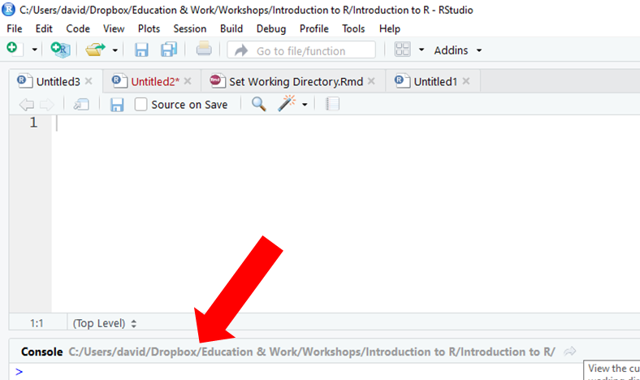

# Setting a Working Directory {#setwd}

A **working directory** refers to the location of a folder within a hierarchical file system. For our purposes, a working directory contains data files associated with a particular task or project. Ideally, a single working directory contains all of the data files you need for a task or project, but in some instances, it might make sense to have multiple working directories for a single project. From our designated working directory, we can read in data files (i.e., import files) to the R environment without adding long paths as prefixes in front of the variable names. Further, anytime you save a plot, data frame, or other object created in R, the default will be to save it to the folder you have set as your working directory (i.e., export files).

#### Video Tutorial

Link to Video Tutorial: https://youtu.be/oSqOqvMkhSE

#### Functions & Packages Introduced

Function           | Package
------------------ | ------------------
`getwd`            | base `R`
`setwd`            | base `R`

### Identify the Current Working Directory

To determine if a working directory has already been set, and if so, what that working directory is, use the `getwd` (get working directory) function from base R. Because this function comes standard with our R download, we don't need to install an additional package to access it. For this function, you don't need any arguments within the parentheses; in other words, leave the function parentheses empty. Alternatively, if you are using RStudio, you will see your current working directory next to the word "Console" in your Console window. 

```{r, eval=FALSE}
# Find your current working directory
getwd()
```
  


### Set a New Working Directory

Let's assume that the current working directory is *not* what we want; meaning, we need to set a new or different working directory. If you need to set a new working directory, you can use the `setwd` function from base R. Within the parentheses, your only argument will be the working directory in quotation marks. I recommend typing your `setwd` function into an R Script (.R) file so that it can be saved for future sessions. I also recommend using the `#` to annotate your script so that you can remind yourself (and others) what you are doing.  
  
When it comes to working directories, R likes the forward slash (`/`) (as opposed to backslash). Remember, the working directory is the location of the data files you wish to access and bring into the R environment. You can access any folder you would like and set it as your working directory. For example, in the code below, I set my working directory to `H:/RWorkshop`, as that folder at the end of that path contains the data files I would like to work with. The folder (and associated path) you set as your working directory will almost certainly be different than the one I set below.

```{r, eval=FALSE}
# Set your working directory
setwd("H:/RWorkshop")
```

Alternatively, you may use the drop-down menus to select a working directory folder. To do so, go to *Session > Set Working Directory > Choose Directory...*, and select the folder where your files live. Upon doing so, your working directory will appear in the Console. You can copy and paste the working directory into your `setwd` function.
  


Once you have set your working directory, you can verify that it was set to the correct folder by (a) typing `getwd()` into your console or (b) looking at the working directory listed next to the word "Console" in your Console window.   

## Summary

In this chapter, you learned how to get and set a working directory using the `getwd` and `setwd` functions from base R.