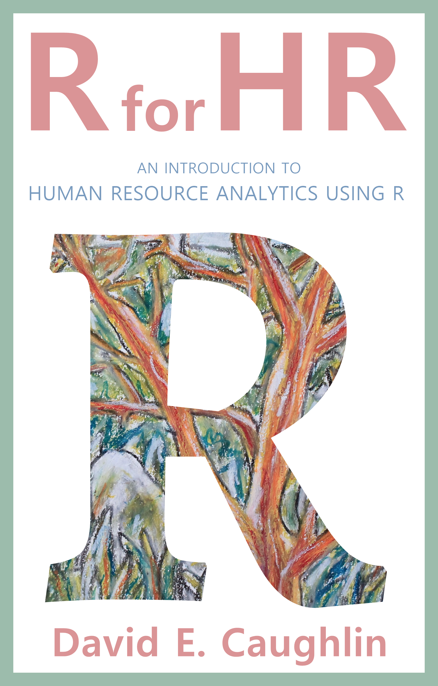
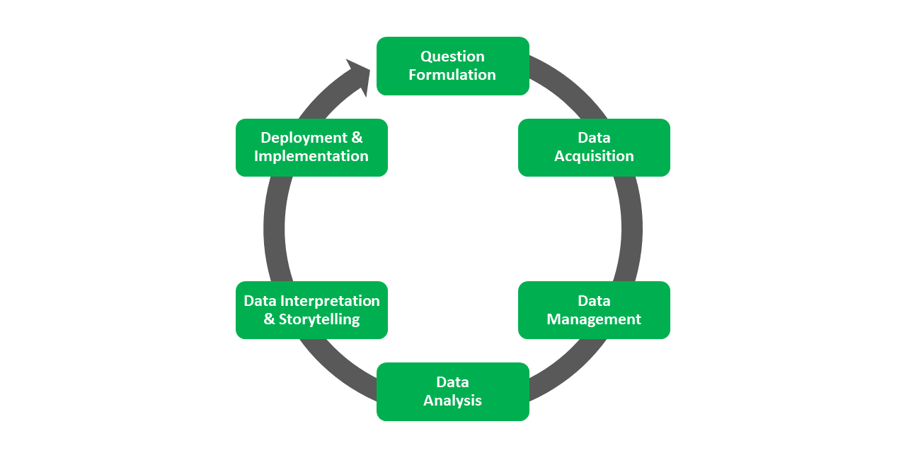

--- 
title: "R for HR:  \n*An Introduction to Human Resource Analytics Using R*  \n*Version: Under Construction*"
author: "David E. Caughlin"
date: "`r Sys.Date()`"
site: bookdown::bookdown_site
output: bookdown::gitbook
documentclass: book
bibliography: [book.bib, packages.bib]
biblio-style: apalike
cover-image: "cover.png"
link-citations: yes
github-repo: davidcaughlin/R-for-HR
description: "Human resource (HR) analytics is a growing area of HR manage, and the purpose of this book is to show how the R programming language can be used as tool to manage, analyze, and visualize HR data in order to derive insights and to inform decision making. [NOTE: This book is currently under construction.]"
---

# Preface {-}

This book is free to read and is licensed under the [Creative Commons Attribution-NonCommercial-ShareAlike 4.0 International License](https://creativecommons.org/licenses/by-nc-sa/4.0/). __[NOTE: This book is currently under construction.]__

## Cover Art {#coverart}



## Growth of HR Analytics {#hragrowth}

The term *human resource analytics* can mean different things to different people and to different organizations. Further, human resource analytics sometimes goes by other names like people analytics, talent analytics, workforce analytics, and human capital analytics. While some may argue for distinctions between these different names, for this book, I will treat them as interchangeable labels. Moreover, for the purposes of this book, **human resource (HR) analytics** is defined as the "process of collecting, analyzing, interpreting, and reporting people-related data for the purpose of improving decision making, achieving strategic objectives, and sustaining a competitive advantage" [@baueretal2020, p. 34]. 
  
The foundation of HR analytics was solidified over a century ago with the emergence of disciplines like industrial and organizational (I/O) psychology. In recent decades, advances in information technology and systems have reduced the time HR professionals spend on transactional and administrative activities, thereby creating more time and space for transformational activities that facilitate the realization of strategic objectives of the organization. HR analytics has the potential to play an integral role in such transformational activities, as it can inform HR system design (e.g., selection tool selection, validation, and process) and high-stakes decision making involving people-related data from the organization.
  
![A 2018 survey of companies highlighted the perceived importance of HR analytics but a relative lack of readiness to adopt and integrate HR analytics [@deloitte2018].](deloittetrends.png)

## Skills Gap

Although HR analytics is now widely regarded to be strategically important for organizational success, an HR analytics skills gap has emerged. Historically, data literacy was not a major focus of academic and professional training for those (soon-to-be) working in HR, and this omission has left some organizations scrambling to hire external talent or to upskill existing HR professionals. For some organizations, it may prove fruitful to close the skills gap by hiring a “quant” (e.g., data scientist, statistician), provided the individual works closely with HR professionals who possess the expertise in HR systems, polices, and procedures, as well as knowledge of HR-specific legal and ethical considerations. I contend, however, that perhaps a better alternative is to upskill existing HR professionals, as their HR-specific knowledge, skills, abilities, and other characteristics (KSAOs) offer a foundation for subsequently layering on data literacy KSAOs. Further, those with existing HR domain expertise often have working knowledge of prevailing employment and labor laws and experience with anticipating and uncovering ethical issues, both of which are necessary when acquiring, managing, analyzing, visualizing, and reporting HR data.


## HR Analytics Project Life Cycle {#hraplc}

I developed the __HR Analytics Project Life Cycle (HRAPLC)__ as a way to conceptualize the prototypical phases of a generic project life cycle. These phases include: (a) Question Formulation, Data Acquisition, Data Management, Data Analysis, Data Interpretation and Storytelling, and Deployment and Implementation. This book provides hands-on learning opportunities for topics and tools related to the Data Acquisition, Data Management, Data Analysis, and Data Interpretation and Storytelling phases. 

  

The phases of the HRAPLC generally align with the steps of the classic scientific process, which include formulating a hypothesis, designing a study, collecting data, analyzing data, and reporting findings. This underscores how HR analytics represents a scientific approach to HR management.


### Question Formulation {#questform}

**Question formulation** refers to the process of posing strategy-inspired and -aligned questions or hypotheses (that can be answered using data) in order to investigate why or how a problem occurs, what a problem might lead to or be associated with, or who is affected by the problem. Thoughtful question formulation results in (a) more effective and efficient data acquisition, management, and analysis, and (b) answers that are more useful to stakeholders. Question formulation is closely associated with **problem definition**, which refers to the process of framing and diagnosing a problem (e.g., challenge, opportunity, threat) for which finding a solution will bring value. In fact, question formulation can be used. 

### Data Acquisition {#dacquire}

**Data acquisition** refers to the process of collecting, retrieving, gathering, and sourcing data that can be used to answer questions and test hypotheses. Different tools can be used for data acquisition, such as employee surveys, (performance) rating forms, surveillance and monitoring, database queries, and scraping or crawling. In some instances, the required data may already reside in an HR information system (HRIS) or enterprise resource planning (ERP) platform. 

### Data Management {#dmanage}

**Data management** refers to the process of wrangling, cleaning, manipulating, and structuring data. Different tools can be used for data management, such as database management systems and data analysis software programs. The general rule of thumb is that you can expect to spend 80% of your time managing data and about 20% of your time analyzing data.

### Data Analysis {#danalysis}

**Data analysis** refers to the process of applying mathematical, statistical, and/or computational techniques to data to identify associations, differences or changes, or classes (categories), as well as to predict the likelihood of future events, values, or differences or changes. Various tools used in data analysis, such as mathematics, statistics, simulations, and computational modeling. 

### Data Interpretion & Storytelling {#dinterpret}

**Data interpretation and storytelling** refers to the process of making sense of data analysis findings and evaluating questions and hypotheses, as well as disseminating the findings to different stakeholders. To support interpretation and storytelling, data visualization is frequently used (e.g., graphs, charts, plots).  
### Deployment & Implementation {#ddeploy}

**Deployment and implementation** refers to the process of prescribing or taking action based on interpretation of data-analysis findings. This phase requires an (a) understanding of stakeholder needs, (b) an understanding of the business context, and (c) knowledge of change management theories and practices.

## My Philosophy for This Book {#philosophy}

Working with data does not need to be scary or intimidating; yet, over the years, I have interacted with students and professionals who carry with them what I refer to as a *numerical phobia* or *quantitative trauma*. Unfortunately, at some point in their lives, some people begin to believe that they are not suited for mathematics, statistics, and/or generally working with data. Given these psychological barriers, a primary objective of this book is to make data analytics -- and HR analytics specifically -- relevant, accessible, and maybe even a little fun. In early chapters, my intention is to ease the reader into foundational concepts, applications, and tools in order to incrementally build self-efficacy in HR analytics. The tutorials in each chapter are grounded in common and meaningful HR contexts (e.g., validating employee selection tools). As the book progresses, more challenging statistical concepts and data-analytic techniques are introduced. Reading this book and following along with the in-chapter tutorials will not lead to expert-level knowledge and skill; however, my hope is that completing all or portions of this book will do the following:

1. Build excitement for working with data to inform decision making.
2. Instill a sense of intellectual curiosity about data and a hunger to expand boundaries of expertise. 
3. Inspire further in-depth training, education, and learning in areas and topics introduced in this book.
4. Enhance data literacy, including knowledge and skills related to (a) critical thinking and logic, (b) mathematics, statistics, and data analysis, and (c) data visualization and storytelling with data.

### Rationale for Using R {#rationalerpref}

Today, we have the potential to access and use a remarkable number of statistical and data-analytic tools. Examples of such tools include (in no particular order) R, Python, SPSS, SAS, Stata, MatLab, Mplus, Alteryx, Tableau, PowerBI, and Microsoft Excel. Notably, some of these programs can be quite expensive when it comes to lifetime or annual user licensing costs, which can be a barrier to access for many.
  
Programming languages like R and Python have several desirable qualities when it comes to managing, analyzing, and visualizing data. Namely, both are free to use, and both have an ever-growing number of free (add-on) packages with domain- or area-specific functions (e.g., data visualizations). It is beyond the scope of this *Preface* to provide an exhaustive comparison of the relative merits of R versus Python; however, when it comes to the statistical analysis of data, specifically, I argue that R provides a more user-friendly entry point for beginners as well as more advanced capabilities desired by expert users, especially for ad-hoc analyses. Moreover, the integrated development environment program called RStudio (which "sits on top of"" base R) offers useful workflow tools and generally makes for an inviting environment within which the R engine to run. 
  
With all that said, Python has been catching up in these regards, and I wouldn't be surprised if Python closes these gaps relative to R in the next few years. I would be remiss if I didn't mention that the Python language is powerful and has capabilities that extend far beyond the management, analysis, and visualization of data. Fortunately, learning R makes learning Python easier (and vice versa), which means that this book can serve as springboard for learning Python or other programming languages. Finally, I believe it to be unlikely that one tool (e.g., program, language) will emerge that is ideal for every task, and thus, I encourage you to build familiarity with multiple tools so that you develop a "toolbox" of sorts, thereby allowing you to choose the best (or at least better) tool for each task.

### Audience {#audiencepref}

I have written this book with current or soon-to-be HR professionals in mind, particularly those who have an interest in upskilling their data-analytic knowledge and skills. With that said, I believe this book can provide a meaningful context for learning key data-analytic concepts, applications, and tools that are applicable beyond the HR context. Relatedly, this book may serve as a gateway to a user-friendly introduction to the programming language called R.

### Structure {#structurepref}

This book consists of the following parts: 

1. Introduction to R
2. Data Acquisition
3. Data Management
4. Data Analysis & Visualization
5. Chapter Supplements
6. References
7. Additional Topics
  
#### Introduction to R {#introductionpref}

The *Introduction to R* (Part 1) introduces the R programming language. This part also focuses on how to install and get started with R and RStudio, including a gentle introduction to foundational concepts and operations associated with the R language.

#### Data Acquisition {#dataacquirepref}

*Data Acquisition* (Part 2) focuses on how to bring acquired data into the R environment -- and how to export data from the R environment. [Data Acquisition](#dacquire) is a key phase of the [HR Analytics Project Life Cycle](#hraplc).

#### Data Management {#datamanagepref}

*Data Management* (Part 3) introduces foundational data management concepts and techniques, such as arranging (sorting), joining (merging), manipulating (wrangling), aggregating, and cleaning data. [Data Management](#dmanage) is a key phase of the [HR Analytics Project Life Cycle](#hraplc).

#### Data Analysis & Visualization {#dataanalvizpref}

*Data Analysis & Visualization* (Part 4) is truly the heart of this book, as it introduces how to apply mathematical and statistical concepts and techniques to specific functional areas of HR (e.g., selection, training). To facilitate the interpretation and communication of data-analysis findings, various data visualization displays are showcased. This part integrates the [Data Analysis](#danalysis) and [Data Interpretation and Storytelling](#dinterpret) phases of the [HR Analytics Project Life Cycle](#hraplc).

#### Chapter Supplements {#chaptersupppref}

The *Chapter Supplements* (Part 5) offer expansions to certain chapters by demonstrating additional concepts and techniques.

#### References {#ref}

The *References* (Part 6) lists the references for the sources that are cited throughout the book.

#### Additional Topics {#addtopicspref}

The *Additional Topics* (Part 7) provides a home to "else" -- or rather, topics that did not fit neatly into Parts 1-5 of the book. Examples of such topics include question formulation and HR information systems.

## About the Author {#aboutauthor}

David Caughlin works for Portland State University's School of Business where he engages in research and teaching on topics related to organizational behavior, human resource management, and data analytics. David received his B.S. in psychology and B.A. in Spanish from Indiana University, his M.S. in industrial & organizational psychology from Indiana University - Purdue University at Indianapolis, and his Ph.D. in industrial & organizational psychology from Portland State University with concentrations in quantitative methodology and occupational health psychology. His research interests are generally focused on supervisor support, work motivation, and occupational safety and health. His research has been published in peer-reviewed outlets such as *Journal of Applied Psychology*, *Journal of Management*, *Human Resource Management*, *Journal of Occupational Health Psychology*, and *Psychology, Public Policy, and the Law*. He co-authored the textbooks *Human Resource Management: People, Data, and Analytics* and *Fundamentals of Human Resource Management: People, Data, and Analytics*. In the School of Business, David teaches undergraduate and graduate courses on topics related to human resource management, information systems, and data analytics. In his HR analytics courses, David teaches students how to apply the statistical programming language R to manage, analyze, and visualize HR data to improve strategic decision making; in the process, students build their data literacy and develop their critical-thinking and reasoning skills. He has received the following teaching awards from the School of Business: Teaching Innovation Award (2018), "Extra Mile" Teaching Excellence Award (2019), and Teaching Innovation Award (2020). In his free time, David enjoys outdoor activities like trail running, skiing, mountain biking, and paddle boarding.

## Acknowledgements {#acknowpref}

My inspiration for writing and compiling the contents of this book stems from interactions with countless colleagues, professional acquaintances, and undergraduate and graduate students, and a broad "thank you" is in order for anyone with whom I have taught or had a conversation about HR analytics specifically or data analytics in general. Finally, I created this book using the following programs and packages: R [@R-base], RStudio [@rstudio2020], `rmarkdown` [@rmarkdown2018;  @R-rmarkdown], `knitr` [@knitr2015; @knitr2014; @R-knitr], and `bookdown` [@bookdown2016; @R-bookdown]. 


```{r include=FALSE}
# automatically create a bib database for R packages
knitr::write_bib(c(
  .packages(), 'bookdown', 'knitr', 'rmarkdown', 'tidyverse', 'dplyr', 'readr', 'tidyr', 'psych', 'readxl', 'magrittr'
), 'packages.bib')
```
